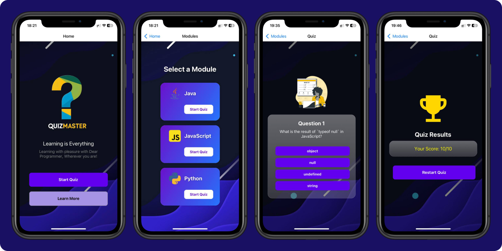

<div align="center">
  
<h2>Quiz-App</h2>
</div>

## Introduction
**Quiz Master** is a fun and interactive quiz app built with **React Native**, **TypeScript**, and **Expo**, designed to provide a seamless and engaging user experience. It features a user-friendly interface, multiple quiz categories, and smooth navigation, making learning enjoyable and accessible. Optimized for both Android and iOS, Quiz Master ensures a responsive design with a well-structured and dynamic quiz experience. Powered by React Navigation for easy transitions and TypeScript for better maintainability, this app offers an interactive and intuitive platform for users to test their knowledge anytime.
#### User Interface

<div>
  
</div>

## Technologies Used
- **React Native**
- **TypeScript**
- **Expo**

## Features
- **User-Friendly Interface** – Clean and intuitive design for a smooth experience.
- **Multiple Quiz Categories** – Test your knowledge across different topics.
- **Cross-Platform Support** – Works seamlessly on both Android and iOS.
- **Built with TypeScript** – Ensures reliability, maintainability, and scalability.

## License
This project is licensed under the **MIT License**. See the [LICENSE](LICENSE) file for details.

## Getting Started

### Prerequisites
To run this project, ensure you have the following installed:
- **React Native**
- **Expo**
- **An IDE (Integrated Development Environment)**

### Running the Application
1. **Clone the repository:**
   ```bash
   git clone https://github.com/yasith-chathuranga/quiz-app.git
   cd quiz-app
   ```

2. **Install dependencies:**
   ```bash
   npm install
   ```

3. **Start the application:**
   ```bash
   npm run web
   ```
4. ```bash
   scan the QR code with your Expo Go app on your mobile device or use an emulator to run the app.
   ```

<div align="center">
<a href="https://reactnative.dev/" target="_blank"></a>
<a href="https://www.typescriptlang.org/" target="_blank"></a>
<a href="https://expo.dev/" target="_blank"></a>
<a href="https://github.com/yasith-chathuranga" target="_blank"></a>
<a href="https://git-scm.com/" target="_blank"></a>
</div>

<br>
<p align="center">
  &copy; 2025 Yasith Chathuranga
</p>